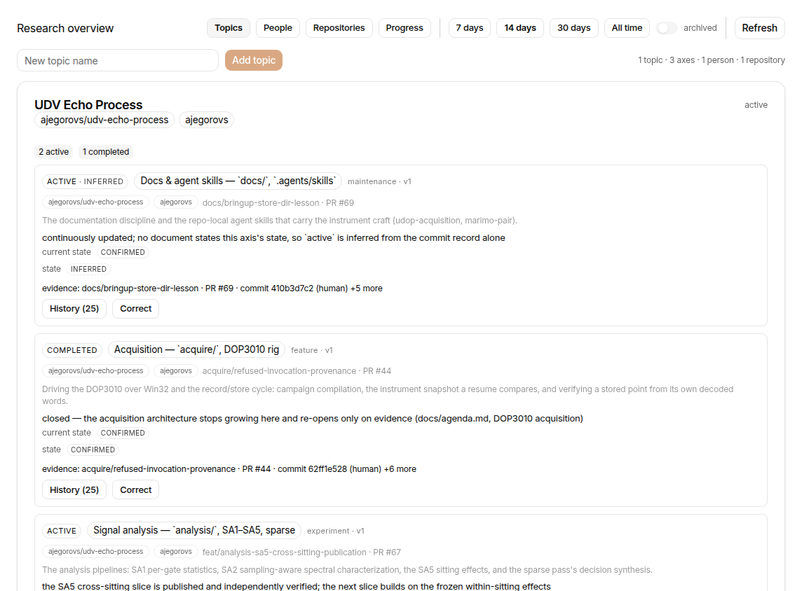
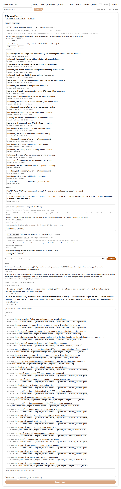
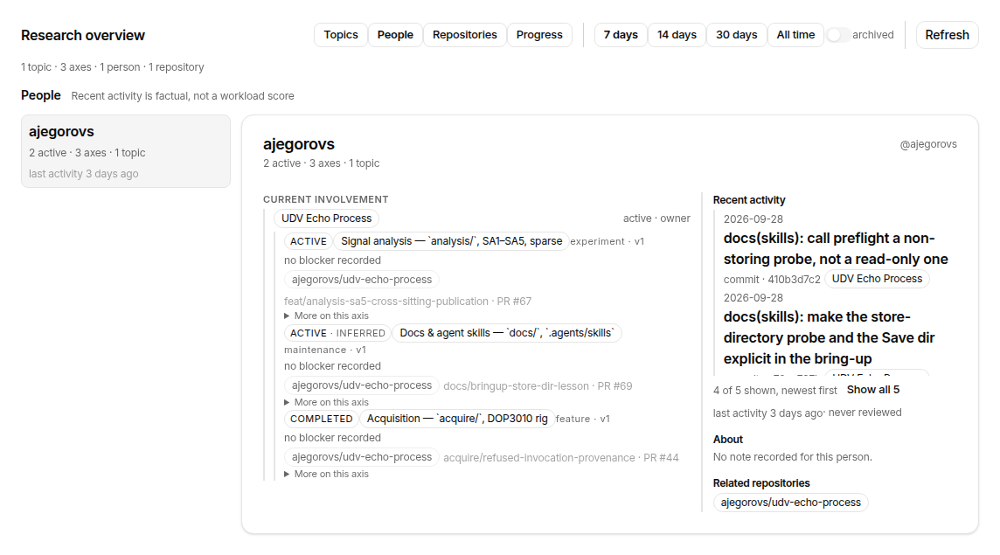
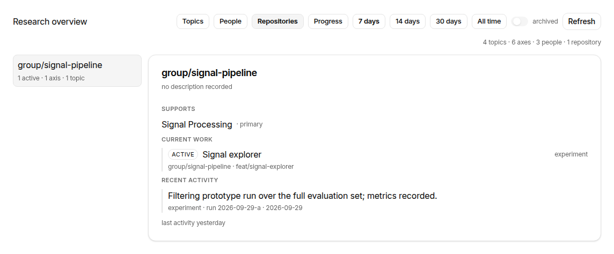
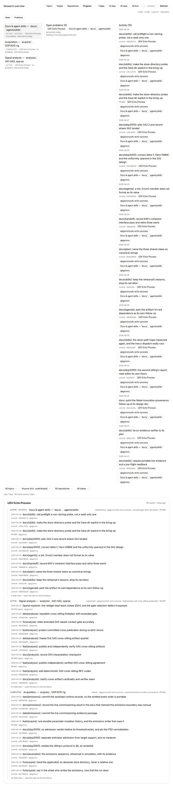
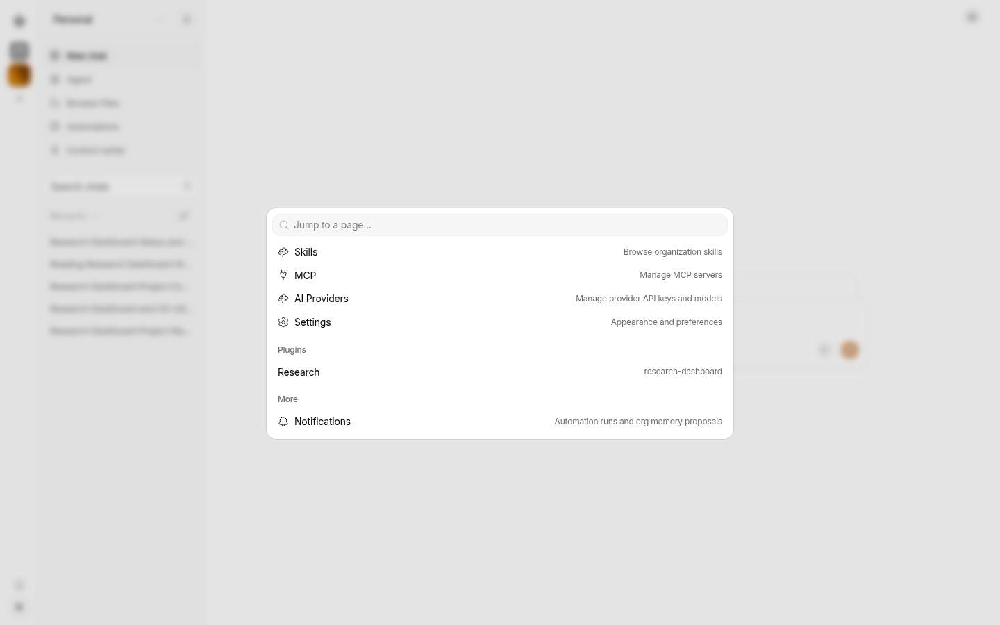

# Research dashboard — Nakama plugin

A dashboard page plus agent tools over **shared coordination state** — topics, development axes and
the evidence attached to them — for a self-hosted Nakama instance. One page (the overview, with the
editing surface underneath it), eight actions of which **five are agent tools**, one skill,
org-scoped SQLite storage.

This repository is the **source of truth** for the plugin. The Nakama server tree is not vendored
here: `vendor/` holds the recipe that puts the plugin into a checkout, because Nakama's bundled
("official") loader only sees plugins that live inside the server's own tree.

> **Reviewing this?** Start with `docs/PLATFORM-CONTEXT.md` (how the plugin fits into Nakama's
> platform model, the constraints that shape any rework, current state, known issues, and an explicit
> *not-verified* list) and `docs/OPEN-QUESTIONS.md` (the five areas we want your judgement on: UI
> layout, extra functionality, multi-user, service delivery, updates). This README covers build,
> layout, loading it into Nakama, and a per-file review table.
>
> Everything needed to build is in here: `bun run check` is the whole story — it typechecks, bundles and
> runs the tests. No network access, private registry or credentials required.
>
> **The V2 rework this review triggered is planned in [`docs/V2-PLAN.md`](docs/V2-PLAN.md)** — chunked
> work packages with acceptance tests, the platform facts that changed three points of the proposal,
> and the open decisions. **Progress: C0–C10 are done**; the real-corpus pass replaced the demo contents
> with a real public repository's history (see `docs/corpus/README.md`), and GitHub evidence automation
> (C11) is a separate capability phase. C0–C6 delivered: migration 002 applied and verified on a live
> instance, the store rewritten around the new model (rollback, version-conflict and cross-process
> contention tests), the action surface rebuilt as **five exposed agent tools** over one atomic write
> path, the **overview** now the default screen (one card per topic, axes grouped under it in
> attention order, an activity window that is a query parameter), the **topic detail** now carrying
> the depth: every axis with its full metadata and per-claim confidence, its own history and notes
> expanding inside it, an evidence line in words beside each inferred claim, and the correction form
> that refuses a stale write in place instead of overwriting it, and the other two views of the same
> payload now switched in the header: **People** (person-first — a compact index, the selected
> person's topics and axes, and only the activity that can actually be attributed to their account)
> and **Repositories** (repository-first — what it supports, the axes naming it, its recorded events),
> and **Progress** (the time perspective — what changed in the window, grouped topic → axis → event,
> newest topic first, filterable by topic, person, repository and axis state). All four render from the
> one payload the page fetches, so switching a view costs no query; one person on several topics is one
> row with their involvement grouped underneath, and nothing is scored or ranked
> (`bun run check` → **82 pass / 472 expect()**). C8 finished the provenance pass: one `StateBadge` renders every axis state
> in every view, so a state that is not `confirmed` says so where it is read (`BLOCKED · inferred`) and a
> confirmed one is only quiet, never unqualified; one vocabulary says what backs a claim (`PR #88`,
> `agent review`, `manual note`, `no evidence on record`); and the two-session concurrency round-trip is
> now an automated test at both levels — the store (A reads, B writes, A is refused, A re-reads and
> retries) and the page (scoped banner, reload, retry, the rationale note atomic with it).
> C9a audited the shipped skill against the surface as built (4 of the review's 8 points had drifted —
> the rollups were undeclared and three store semantics unstated — now fixed and pinned by tests), and
> **C10 retired generation 1**: `003-drop-legacy.sql` drops `projects_v1`/`activities_v1`, verified inert
> against a compact V2 snapshot before/after, on the fixture *and* on the real database. That is the point
> where the legacy copy genuinely disappears, so a pre-003 copy is kept under the dev data root's
> `backups/`. With C10 done the dashboard is complete; GitHub evidence automation (C11) is a separate
> capability phase, and the layout rework that follows this handoff is briefed in
> [`docs/layout-rework-brief.md`](docs/layout-rework-brief.md).
> What the agent side actually does is checked against the
> platform, not the manifest: `GET /v1/tools` lists exactly the five tool rows, and a live three-turn
> run used all five (`find_tools` → `get_overview`; `find_tools` → `search_dashboard` ∥ `get_topic` →
> `reconcile_topic`; `find_tools` → `get_topic` → `search_dashboard` → `record_activity`) with both
> writes landing and attributed. Note the discovery cost is **per turn**, not per surface: plugin tools
> are loaded by `find_tools` for one user request at a time, and one search returns the whole
> five-tool group. The review itself is kept verbatim at
> [`docs/reviews/2026-09-30-v2-structural-redesign.md`](docs/reviews/2026-09-30-v2-structural-redesign.md).
>
> **Answered 2026-09-30** — the delta review is closed:
> [`docs/reviews/2026-09-30-v2-plan-answer.md`](docs/reviews/2026-09-30-v2-plan-answer.md). Five
> decisions landed (three confidence columns; `axis_repositories` replacing the single repo FK; topic
> states `active/paused/completed/archived`; five exposed tools instead of eight; copy the V1 data), and
> one of our claims was corrected — the platform *does* validate `inputSchema` at runtime. The last
> open item (real topic names in a public repo) was resolved the same day: every example — docs, test
> fixtures and the screenshots — stopped using real names. **Revised 2026-10-01 (D10):** the neutral
> placeholders are themselves retired in favour of a real **public** corpus —
> `ajegorovs/udv-echo-process` — so the layout is judged on states we did not choose while the repo
> still carries nothing unpublished. See [`docs/corpus/README.md`](docs/corpus/README.md).
>
> **Answered again after C3** — the two questions the C3 handoff left open
> ([`docs/reviews/2026-09-30-c4-c8-answers.md`](docs/reviews/2026-09-30-c4-c8-answers.md)): a manual
> status change carries an **optional** note (D8, C8's work), and the overview presents **axes grouped
> under topics** with `blocked → active → draft → parked → completed → abandoned` ordering (D9, which
> shaped C4). Neither needed a schema change. D8's note landed early, in C5: a manual status change
> takes an optional rationale, and that note is itself the evidence a `confirmed` claim can rest on.

## Current look

The page as it renders today, on the repository's own history: `ajegorovs/udv-echo-process` is a real,
**public** repository (625 commits, 69 PRs), seeded through the plugin's own action surface — no row
hand-typed — so what you see below are states we did not choose. Nothing here is unpublished group
work; the pack behind these images is [`docs/corpus/README.md`](docs/corpus/README.md).

|  |  |  |  |  |  |
|---|---|---|---|---|---|
| `dashboard.png` — the overview: one card per topic, axes grouped under it in attention order (blocked first), people, state counts, repo/branch/PR line, blocker and a recent-activity summary. The window control is the only query-level control. | `dashboard-detail.png` — the topic detail: the whole of it in one `get_topic` call — description and summary, counts, corrections/notes kept apart from the activity log, and every axis with its full metadata, per-claim confidence, evidence line and its own history and notes behind `History (n)`. Captured with the editor open, because a card that hides no axes offers no expander — see the pack for why that is a finding and not an artifact choice | `dashboard-people.png` — the People view (C6), person-first: the index on the left, the selected person's topics with their own axes on the right. Activity is listed only where the store can attribute it, and a person with no mapped account says so instead of showing an empty log. | `dashboard-repositories.png` — the Repositories view (C6), repository-first: the topics it supports (declared link), the axes naming it, and the events recorded against it or against one of those axes. | `dashboard-progress.png` — the Progress view (C7), the time perspective: what changed in the window, grouped topic → axis → event, newest topic first, each axis keeping its own state, repository, branch and PR, with filters for topic, person, repository and axis state. | `navigation.png` — how a member reaches it: command palette → Plugins → Research (no sidebar entry in v0.4.31) |

## Why not published to npm

Third-party Nakama plugins install **only** from the public npm registry at an exact version — local
paths, Git URLs, private registries and archive uploads are rejected (`plugin-service.ts` pins the
registry host and checks the tarball URL). The supported way to run an unpublished plugin is the
*bundled* path: a package under `<server>/packages/plugins/<id>` plus an entry in the
`OFFICIAL_PLUGINS` allowlist. That is what `vendor/` does, and it is also the shape a custom image
would ship.

## Build and test on any machine

Needs only [Bun](https://bun.sh) and `bun install`. No checkout of Nakama and no runtime dependencies:
every `@nakama/*` and `react` import in `src/` is **type-only**, so nothing is resolved at build time.

That last point is why this repo carries `types/host.d.ts`: "type-only" means nothing is *bundled*, not that
nothing is *checked*. The host packages (`@nakama/ui`, `@nakama/core`) are not published, so the slice of them
this plugin uses is declared in that file — derived from the host's sources, and cross-checked against the real
thing by `bun run typecheck:host` (which needs a Nakama checkout). See `types/host.d.ts` for the full rationale.

```bash
bun install        # dev dependencies: typescript, @types/bun, @types/react, playwright-core
bun run check      # typecheck + build (actions/actions.js, ui/app.js) + store tests
bun run typecheck  # tsc --noEmit over src/ and types/ — the part that is not a bundler
bun run typecheck:host  # the same check against the REAL host types, from a checkout (authoritative)
bun run build      # build only
bun test src       # tests only — the store is testable without a host
```

`bun run check` being green means **three** things: the code typechecks, it bundles, and the tests pass. It
did not always mean that — `bun build` strips types rather than checking them, so before the `typecheck` step
existed nothing in this repository had ever verified a type, and a projection that read a property its type
does not have reported every axis as never stale without a single failure. `tsconfig.json` and
`types/host.d.ts` exist because of that; both carry the reasoning.

`harness/*.mjs` is deliberately outside the typechecked program: it is operator tooling (replays, page
verification, install), not shipped plugin code. That is a scope decision, not a suppression — it is stated in
`tsconfig.json` where the scope is set, and recorded below as a future hardening item rather than left as an
unexplained gap.

**`@types/react` is pinned to `18` on purpose, and upgrading it is not a drop-in.** `src/ui.tsx` uses the
classic JSX runtime with the host's `React` as a global (`jsx: "react"` in `tsconfig.json`), and it relies on
the global `JSX` namespace that `@types/react@18` still declares. Newer versions move JSX into `React.JSX` and
drop the global, which would turn every element in a 2,800-line page into a `TS7026`. Changing the pin means
changing the JSX model and the host's injection contract together — a reviewed change, not a version bump.

### Future hardening item: the harness is not typechecked

Recorded by reviewer ruling (U3 step 1) as **out of scope now, not silently excluded**:

> Evaluate `checkJs`, or migrating the critical harness scripts to TypeScript, prioritizing the scripts that
> determine acceptance evidence — `replay-corpus.mjs` (the dataset), `install-plugin.mjs` (what gets deployed),
> `verify-page.mjs` (the page assertions), and `test-004.mjs` (the migration proof).

Those four decide what the acceptance numbers mean, so they are the ones where a silent type error would cost
the most. Pulling them into the same strict contract broadens what a green `bun run check` means, so it should
be its own reviewed change on its own baseline.

`actions/` and `ui/` are **committed on purpose**: the manifest points at them and a reviewer should be
able to read what the server actually executes. To confirm they match `src/`, run `bun run build` and
check that `git status` is clean — a non-empty diff means the committed bundles are stale.

## Layout

```
nakama.plugin.json      manifest: actions, skill, migration, UI entry, schemas
migrations/             SQL applied to the organization's plugin database generation
src/store.ts            bun:sqlite data access (topics, axes, repositories, people, activities, annotations)
src/actions.ts          the action surface: five agent tools + page/admin actions, no transaction logic
src/ui.tsx              the single plugin page: the three views (C4 overview, C5 topic detail, C6 people/repositories) with the editing surface underneath
src/store.test.ts       store tests (migrations applied, no host)
src/actions.test.ts     action + manifest tests (result shapes, provenance, schema allowlist)
skills/research-coordinator/SKILL.md   what the agent is told about this plugin
actions/, ui/           build output — never edited by hand
vendor/                 allowlist.patch + vendor-into-nakama.sh + in-tree package.json
```

## Loading it into Nakama

```bash
git clone <nakama-checkout> && cd nakama
/path/to/this/repo/vendor/vendor-into-nakama.sh "$PWD"
bun install
bun run apps/server/src/index.ts        # or build an image with the plugin in place
```

The script copies the plugin to `packages/plugins/research-dashboard`, swaps in the in-tree
`package.json` (which keeps the `workspace:*` devDependencies of a workspace member), and applies
`vendor/allowlist.patch` — a one-line addition to `OFFICIAL_PLUGINS`, verified to apply cleanly to a
pristine upstream checkout. It is idempotent: re-running it will not duplicate the allowlist entry.

On a running instance (platform admin + org admin):

1. `GET /v1/plugins/official` — `research-dashboard` should be listed.
2. `POST /v1/plugins/official/research-dashboard/install`
3. `POST /v1/plugins/research-dashboard/enable` — creates the organization data store.
4. Open it from the dashboard's command palette (`Ctrl/Cmd+K` → "Plugins"). In the build this was
   developed against, plugin pages are **not** in the sidebar.
5. After a rebuild: `POST /v1/plugins/official/research-dashboard/reinstall`, which snapshots the new
   bytes as an immutable `+dev.<digest>` release for that organization only, keeping its data.

## Run the acceptance pass

`harness/` is the pass that produces every number and screenshot in `docs/`: it logs into the dashboard,
opens the plugin page in real Chromium, prints one `PASS`/`FAIL`/`SKIP` line per check, writes a
transcript and captures the views. Read-only unless `--write` is given, and it refuses to silently skip —
a check whose subject a dataset does not have prints `SKIP` **with its reason**, so "0 failed" can never
hide "4 never exercised".

The two datasets must not be mixed. Give each its own instance (or at least its own `NAKAMA_CONFIG_DIR`).

**Once, for either dataset** — an instance with this plugin installed, and a chromium:

```bash
git clone <nakama-checkout> && cd nakama
/path/to/this/repo/vendor/vendor-into-nakama.sh "$PWD"
bun install
# the instance, with a data root of its own
NAKAMA_HOST=127.0.0.1 NAKAMA_PORT=4399 NAKAMA_CONFIG_DIR=/tmp/nakama-review \
NAKAMA_SEED_ADMIN_EMAIL=admin@nakama.local NAKAMA_SEED_ADMIN_NAME=Admin \
NAKAMA_SEED_ADMIN_PASSWORD=<pick-one> bun run apps/server/src/index.ts
# and the dashboard web dev server in a second shell — plugin pages live inside it:
cd apps/web
NAKAMA_SERVER_URL=http://127.0.0.1:4399 bun run vite --host 127.0.0.1 --port 3003

cd /path/to/this/repo
bun install                                   # playwright-core
node node_modules/playwright-core/cli.js install chromium   # or set PLAYWRIGHT_CHROMIUM to any chrome binary
```

The checkout root also has a `dev:web` script (`bun run --filter @nakama/web dev`). It honours
`NAKAMA_SERVER_URL`, but it *starts a server of its own* when that URL is not answering, and it passes
no port flag to vite, so the web port is whatever `apps/web/vite.config.ts` says. The direct invocation
above is the one that can be aimed at a specific instance on a port you pick — which is what running two
datasets side by side needs.

Install and enable the plugin with the env file — one command, which first checks the instance's catalog
(the failure that means the `vendor/` step was skipped) and exits non-zero if it refuses:

```bash
cat > /tmp/nakama-review.env <<ENV
NAKAMA_URL=http://127.0.0.1:4399
NAKAMA_DASHBOARD=http://127.0.0.1:3003
NAKAMA_EMAIL=admin@nakama.local
NAKAMA_PASSWORD=<the same one>
ENV

cd /path/to/this/repo
bun harness/install-plugin.mjs --env-file /tmp/nakama-review.env
```

The same file feeds every script here (`NAKAMA_EMAIL` / `NAKAMA_PASSWORD`, plus `NAKAMA_URL` for the API
and `NAKAMA_DASHBOARD` for the web origin). Arguing a flag through an npm script works the usual way —
`bun run harness:read -- --env-file /tmp/nakama-review.env` — and if a script cannot find credentials it
says which names it looked for and exits 2 rather than failing checks.

**Reading a transcript: three outcomes, and one value that is time-relative.**

A run has four exits, and `harness/read-pass.sh` archives only two of them:

| exit | meaning | the committed record |
|---|---|---|
| `0` | every check passed | **replaced** (a PASS verdict) |
| `1` | checks failed — still a verdict, not an incident | **replaced** (a FAIL verdict) |
| `2` | **ABORTED** — the pass died mid-run | left untouched; the run stays in `$TMPDIR`, and the transcript says `ABORTED … this transcript is PARTIAL` |
| `3` | **REFUSED** — the instance is not the dataset this run asked for | left untouched |

The guard is why exit 3 exists: the pass derives the instance's dataset from durable markers (the fixture's
`Layout fixture …` topics and repositories under `fixture/`, and the corpus's *absence* of both) **before any
check runs**, and refuses when that does not match `--dataset`, including the mixed case. A run that measured
the wrong dataset used to look exactly like a short successful one; now it cannot be recorded at all.

One recorded value is **legitimately time-relative**: the topic card's `Recent: N events` is the projection's
own count over a wall-clock window (`activitySinceDays`, default 14), so a record taken on a different day may
differ by a small number **in that one line**. That is drift, not a failure — a stable clock would be a
projection design change, not a harness fix. Every other recorded detail is byte-reproducible: three
consecutive runs per dataset produce identical transcripts apart from the `# generated:` timestamp.

**Serving a new build.** `install-plugin.mjs` installs and enables; it does not serve changed bytes. After
`bun run build` and `vendor/vendor-into-nakama.sh`, mint a release from the vendored checkout with:

```bash
bun run harness:reinstall -- --env-file /tmp/nakama-review.env
```

It reads the installed revision, reinstalls with it as the guard, and prints the version change — or says so
plainly when the vendored bytes are identical to the release already installed, which is the case where a pass
would otherwise silently measure the previous build.

**Corpus** (the real, public dataset) — seeded by replaying the committed transcript, which is the
corpus's own record:

```bash
bun harness/replay-corpus.mjs --env-file /tmp/nakama-review.env   # 695 calls, ~75 s
bun run harness:read -- --env-file /tmp/nakama-review.env
bun run harness:read -- --env-file /tmp/nakama-review.env --viewport 1280x800   # the second reference width
```

On a current checkout expect the replay to be *paced by the server*, not by the script: the action
endpoint is rate-limited, and a full replay at ~11 calls/s draws `429 Too many requests` around call 600.
The replayer backs off (honouring `Retry-After` when it is sent) and retries; if a call still fails it
prints the exact resume command, and resuming is safe in the sense that it is *additive* — the calls
before that point were already accepted and are not re-sent. A dataset seeded by two overlapping runs is
the one thing the guard cannot see, so use `--force` only to resume.

**Two suites run beside the pass, and both gate a handoff.** `bun run harness:identity` asserts the
dataset-identity classifier (corpus / fixture / acceptance-write residue). `bun run harness:records` asserts that
no committed artifact carries a **live endpoint**: what `read-pass.sh` writes into a transcript header and what
the palette check prints for its PASS line both go through `harness/redact.mjs` — loopback verbatim, anything
identifying (`http://100.x`, a MagicDNS name, `.local`, this machine's hostname) replaced by
`<box>.<tailnet>.ts.net` with port and path kept, public hosts left alone — and the suite scans every text file
under `docs/` for anything the rule would have redacted. A record carrying a live endpoint fails the check that
gates the next one.

**Synthetic edge states** — on a *second* fresh instance, same env file pointed at it:

```bash
bun harness/apply-layout-fixture.mjs --env-file /tmp/nakama-review.env
bun run harness:fixture -- --env-file /tmp/nakama-review.env
bun run harness:fixture -- --env-file /tmp/nakama-review.env --viewport 1280x800
```

The layout fixture also seeds **Fixture E** (contract `fixtures.md` §E): one open Problem on two repositories
with a person link, an activity, an evidence record, a human-authored steering note and a plan step it sits
on, plus a second Problem with no plan step, no repository and no artifact. It is applied by the same command,
it is re-runnable without duplicating itself, and it **does not move the counts below**. It takes two calls
internally (activities, annotations and plan-step links cannot name a problem created in the same transaction,
and row ids are server-generated); the applier reads the ids back and does the referencing pass second.

Expected as of U4's step 7, on **separate instances** — a corpus-only one and an isolated fixture-only one:
corpus **84 pass · 0 fail · 22 skip** and fixture **107 · 0 · 0**, at both viewports (the fixture now records *zero* skips: U10's two seeds gave the repository-tag and exceptional-state checks their subjects).

**Current records (C1 refinement pass, revision 442, `0.2.0+dev.aed4d024c37e`):** corpus **115 · 0 · 23** at
1440×900 and **114 · 0 · 24** at 1280×800, the write pass **127 · 0 · 23** — ten checks more than the
revision-410 set below, apiece, and all ten are the hierarchy pass's: the per-view heading in all four views,
the rail's lead / stated remainder / expand / collapse, the three-level axis row with its one disclosure, the
axis row's reading and detail compared verbatim against `get_topic`, and the rail's three cards beginning in
the first screen. That last check is asserted at the reference reading size and **skipped elsewhere with its
reason**, which is why the 1280×800 record reports one skip more than 1440×900 and not a failure. The fixture
pair **is** re-run on this build — on the second instance's own web origin with its own seed admin, addressed
through its own env file (`compose/nakama/.env.fixture`): fixture **140 · 0 · 0** at 1440×900 and
**139 · 0 · 1** at 1280×800, the skip being the same first-screen check at a non-reference viewport with its
reason — ten checks more than the revision-410 fixture pair as well. That run is also what caught the two
fixture-only failures this build's records come from; the finding and its diagnosis are in
`docs/reviews/2026-10-02-c1-acceptance-record.md` § Fixture pair on the final build. Read a run's own summary
line, never a number in this document.

**Historical records (C1, revision 410, one session on one build):** corpus **105 · 0 · 23** at both
viewports, the write pass **117 · 0 · 23**, fixture **130 · 0 · 0** at both viewports. The corpus skip
count moved from the 34 this document quoted earlier for a dataset reason, not a check-set one: a corpus
re-seeded by the current `replay-corpus.mjs` derives **3 problem rows and 3 repository-naming events**
from its own material (the seeder prints both), so eleven checks that previously had no subject are now
exercised — the same eleven lines are present in both records, SKIP in the older one and PASS in the
current one. Read a run's own summary line, never a number in this document.

**A pass that cannot be trusted is not recorded:** it refuses (exit 3, `read pass: REFUSED — no verdict, no record`) when the instance is not the dataset `--dataset` asked for — identity comes from the fixture's own naming (`Layout fixture …` topics, `fixture/` repositories) and the corpus's *absence* of it, so a **mixed** instance is refused too — and an abort prints `ABORTED … this transcript is PARTIAL` and exits 2; on either code the committed transcript is left untouched and the partial run is kept in `${TMPDIR}`. Step 7's first half added ten checks, its second half nine more (the shared grammar: one badge, one recency label, one detail header, one activity line and one notice across all four views, with the tags each view now emits asserted against its own projection)
(the EntityTag contract exercised from Progress: the reading surface's topic and axis tags carry the
projection's own ids and labels, every tag in the Activity column names an entity its own event carries, an
attributed event's person is a tag, and the topic, person, repository, problem and axis tags each land in their
canonical view **with the entity actually selected there** — the expanded card, the detail panel, the active
row — plus that no status badge is a tag and that the whole traversal issues no write call and leaves the
payload identical). The fixture exercises nine of those; the corpus eight. Step 6 had added seven checks
(the `Axes | Problems` switch: the control and its default, the problem index against the projection's own list
and order, the same reading surface and parent-axis follow-through when one is picked, the sections rendering
from that same problem object, the parent-axis bridge back to `Axes`, and — on both datasets — that switching
issues **no** action call and leaves the live payload identical, which is what makes it a switch over one model
rather than a second view). The corpus exercises four of those and skips the three that need a problem row.
The record before that, at U4's step 6: corpus **56 · 0 · 30** and fixture **87 · 0 · 0**;
before *that*, at U4's step 5: corpus **52 · 0 · 26** and fixture **80 · 0 · 0**. The corpus record
before *that* (**43 · 0 · 7** out of 50 checks) was taken against the **shared dev instance**, which is
not corpus-only — a corpus pass there reads the fixture's topic next to the corpus one (6 axes / 2 people / 3
repositories) — and it predates steps 3–5's checks, so it is superseded rather than re-derived. The 32 skips
are the checks a corpus with **no problem rows and no plan** cannot exercise — plus the two step-7 checks whose
subject no dataset has yet (**no recorded event names a repository**, so the Activity column's repository tag
renders nowhere; and the corpus has no problem to name) — and each prints its reason, so "0 failed" never hides
"32 never exercised".
(Before U1 it was 42 and 49 — U1 added one check, "every axis state the payload carries
reaches the page as that state", and the `abandoned` fixture axis it needs. U4's step 1 added the Progress
window check, taking the fixture pass to 51; step 2 added six that compare the three-column composition and
its selection against `get_progress`'s own answer, taking it to 57; step 3 added five for the optional Plan
section — its absence, the stored positions, the plan ↔ problem link both ways, and the unordered-plan
discriminator — taking it to **62**; step 4 added eight for the open-problem inventory and removed the one that
asserted step 2's inline list, which that column no longer holds — taking it to **69**; step 5 added eleven for
the three supporting sections, the two repository tags that must both navigate, and the cases each section must
not show, plus one guard that the subject axis is real — taking it to **80**. The pass then swapped one check
for another (the closed-out precondition folded into the conditional that replaced it; a new precondition that
the `get_progress` payload carries all three halves the page reads), so the total stays **80**, not 81. Step 6
added seven for the `Axes | Problems` switch — the control and its default, the problem index against the
projection's own list and order, the reading surface and parent-axis follow-through when one is picked, the
sections rendering from that same problem object, the parent-axis bridge back to `Axes`, and the two
dataset-independent claims (no action call, identical payload) — taking it to **87**.) The
counts move
whenever a check is added, so read the run's own summary line rather than a number in a document. Each run
writes its transcript to
`docs/corpus/verify-read[-<viewport>].txt` or `docs/layout-fixtures/verify-fixture-read-<viewport>.txt`
and its screenshots under `docs/screenshots/` or `docs/layout-fixtures/screenshots/<viewport>/` — i.e.
over the committed record, by design: re-running is how the record is refreshed. `--shots` and
`--transcript` divert a scratch run so it does not.

`--write` drives the page's surviving writes without a create form: it creates a topic through the
plugin's own action (the way the librarian does), opens the folded write affordances the way a reader
does, writes a topic note from the read detail, and then exercises the stale-correction refusal inside
an axis — including that the refused correction wrote nothing and kept what was typed. It **mutates the
dataset** — wipe and re-seed afterwards; the corpus must not carry a `ui-check …` topic.

## Applying a plugin migration

Migrations are declared in `nakama.plugin.json` (`database.migrations`) — a `.sql` file that is not
registered there is never run, and `bun harness/update-plugin.mjs` refuses to start if the manifest and
`migrations/` disagree.

The host applies migrations **during an install/enable/update cycle, never at boot**, and a pending
migration makes it build a **new database generation** — a copy of the current one with the migration
applied. The previous generation is left in place, untouched, which is what makes a rollback a file that
nothing has written to rather than a reconstruction. (`docs/ux-v2/U1-migration.md` §5.3.)

On a checkout loaded as a bundled plugin:

```bash
./vendor/vendor-into-nakama.sh /path/to/nakama        # the instance reads the vendored copy, not this tree
bun harness/update-plugin.mjs --env-file /tmp/review.env --data-root /path/to/nakama/data
```

`update-plugin.mjs` drives `POST /v1/plugins/official/<id>/reinstall` ("reload a bundled official plugin
while preserving organization data"), waits for the install to settle, and — with `--data-root` — prints the
old and new generation with their row counts, so "did my data survive" is answered by the run rather than
by hope.

**Vendor first, or you will ship the previous build.** The reinstall installs from the checkout's vendored
copy, so running `update-plugin.mjs` on its own after a `src/` change mints a new release, bumps the revision
and leaves the *old* bundle in place — the run reports success and the instance keeps serving the code you had
before. The symptom is a change that simply does not appear (once, an action still answering with its previous
key set, which showed up as a `TypeError` in the harness rather than a wrong number). Always
`vendor-into-nakama.sh` → `update-plugin.mjs`, in that order, and treat the release's `+dev.<digest>` changing
as the evidence that a new bundle was actually installed.

Migration 004's own tests run without any instance:

```bash
bun harness/test-004.mjs                                       # self-contained: applies 001→003, then 004
bun harness/test-004.mjs --db /path/to/pre-004-database.sqlite  # and against a real one, on a copy
```

They cover preservation (by identity, not just counts), the foreign-key definitions the rebuilds must not
lose, every state-log combination that must be rejected, the reopen cycles, and the crash-after-COMMIT
re-run that the host's ledger ordering makes possible. 79 checks, and a failing one prints what it got.

## What a reviewer should look at

| File | Question |
|---|---|
| `src/actions.ts` | Does every action validate its input, and does a caller-fixable failure come back as `{ok:false,error}` rather than a thrown error? |
| `src/store.ts` | Are all queries scoped to the organization's database handle, and are identifiers parameterised? |
| `tsconfig.json` | Are the include scope and the strictness flags the ones you would have chosen — and is anything excluded that you would expect to be checked? |
| `types/host.d.ts` | Does the declared host surface match `packages/ui/src` and `packages/core/src/plugins.ts`? It is derived from them, not published by them, and `bun run typecheck:host` is what keeps it honest. |
| `nakama.plugin.json` | Are the action schemas tight enough to reject junk (enums, lengths, required fields)? |
| `skills/research-coordinator/SKILL.md` | Does it draw the line between recorded facts and interpretations? |
| `migrations/001-research.sql` | Additive and idempotent? Migrations are forward-only — the host refuses downgrades. |

## Result contract

Actions return `{ok: true, ...}`, or `{ok: false, error}` when the caller can fix the input (unknown
project, empty field). Nothing user-fixable is thrown: an error thrown from plugin code reaches the
caller as `{"error":"An unexpected server error occurred."}`, and schema violations are rejected
earlier by the host as `{"error":"invalid_input"}` (HTTP 400).

## Tool naming

Agent tool names replace the hyphen in the plugin id with an underscore —
`plugin_research_dashboard__get_overview`, not `plugin_research-dashboard__…` as the upstream docs
imply from `plugin_<id>__<key>`. Quote the underscore form in skills and prompts.

## Scope

Deliberately thin: the coordination tables (`topics`, `development_axes`, repositories, people, link
tables, `activities`, `annotations`), five agent tools over one atomic write path, one page. All three
views are in — the overview with its editing surface, the topic detail, and the people, repositories and
progress views, which are read-only and ride the same `get_overview` call. Provenance marking in the UI
and the optimistic-concurrency round-trip are in as well; GitHub/repository automation (C11) is **not** —
see `docs/V2-PLAN.md`. `topics.summary` is the only place an interpretation lives, and it is meant to be
human-approved.
